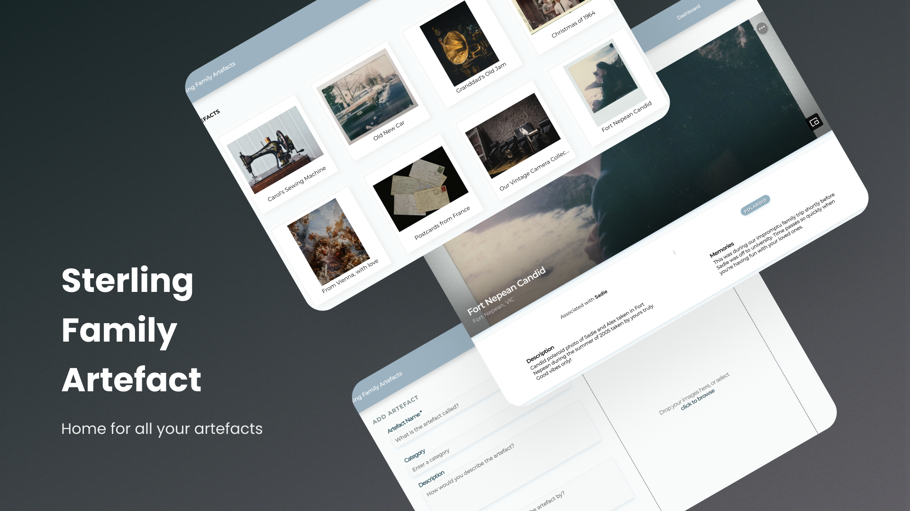

<!-- PROJECT LOGO -->
<a name="readme-top"></a>

[![Contributors][contributors-shield]][contributors-url]
[![Issues][issues-shield]][issues-url]
[![MIT License][license-shield]][license-url]

<br />
<div align="center">
  <a href="https://github.com/LeoniA29/ITProject-FiveFingers">
    
  </a>

  <h3 align="center">Sterling Family Artefact</h3>

  <p align="center">
    Home for all your artefacts
    <br />
    <a href="https://fivefingers.atlassian.net/l/cp/AuHmbHFH"><strong>Explore the docs »</strong></a>
    <br />
    <br />
    <a href="http://157.245.156.125/login">View Demo</a>
    ·
    <a href="https://github.com/LeoniA29/ITProject-FiveFingers/issues">Report Bug</a>
    ·
    <a href="https://github.com/LeoniA29/ITProject-FiveFingers/issues">Request Feature</a>
  </p>
</div>


## Sterling Family Artefact

Sterling Family Artefacts **is a home for all your artefacts**. Easily preserve all of your family legacy and memories. Stay organised with Sterling Family Artefacts.


## Table of Contents

- [Project Background](#project-background)
  * [Description](#description)
  * [Requirements](#requirements)
  * [Team Members](#team-members)
  * [Required Features](#required-features)
  * [Additional Features](#additional-features)
  * [Documentation](#documentation)

<!-- ABOUT THE PROJECT -->
## About The Project



### Description
Sterling Family Artefact, a project by Group 098 (Five Fingers) of University of Melbourne's COMP30022 IT Project, is a CRUD (Create, Read, Update, Delete) interface web application to store photos of our client's family artefacts. Sterling Family Artefact offers a personalised experience for our client, developed with robustness in mind, and shared in DNA many similarities with our client’s site – from the colour scheme to the font usage. This application enables users to create records of artefacts, read it in various different formats and styles, edit and delete existing artefacts, and is compatible on both mobile and desktop devices to conveniently show artefact records to the user's friends and family anytime, anywhere.

This gave us the following requirements:

### Requirements
| Required Features                                         | Stretch Features |
| --------------------------------------------------------  | ---------- | 
| Log in and Log out Functionalieis                         | Implement a folder system    | 
| View Partial Data of the Artefact                         | Add multiple images for one artefact record    | 
| View Full Data of the Artefact                            | Search artefacts by name and description    |
| View Artefacts in a table format                          | Search artefacts by cateogies and association    |
| Add Artefacts                                             | Do ontology searches    |
| Add speicfic cateogries or assocaition for an artefact    | Do fuzzy searches    |
| Edit previous registered artefact                         | Implement a pagination feature    |
| Delete existing artefacts                                 |     |

<p align="right">(<a href="#readme-top">back to top</a>)</p>

### Team Members
| Name                    | Student No | Email                             | 
| ----------------------- | ---------- | --------------------------------- | 
| Leoni Angela            | 1179015    | leonia@student.unimelb.edu.au     | 
| Nadya Aurelia Herryyanto| 1185814    | nherryyanto@student.unimelb.edu.au| 
| Nicholas Riykco Widjaya | 1179000    | riykco.widjaya@unimelb.edu.au     | 
| Tahmin Ahmed            | 1146663    | tahmin@student.unimelb.edu.au     | 
| Vincent Kurniawan       | 1110090    | vkurniawan@student.unimelb.edu.au | 

**Supervisor**  
Stephanie Brooke

<p align="right">(<a href="#readme-top">back to top</a>)</p>

## Documentation
- [Project Roadmap](https://fivefingers.atlassian.net/l/cp/fXsAt7vx)
- [Low Fidelity Prototype](https://www.figma.com/file/fnZ2IqeLl3tUlzs3on4mkA/Low-Fidelity-Brainstorm-Scribbles?node-id=0%3A1)
- [High Fidelity Prototype](https://www.figma.com/file/9qD6wRJdeD93kv5KwXBW86/High-Fidelity-Prototype?node-id=2%3A2)
- [User Stories](https://fivefingers.atlassian.net/l/cp/A1Gs3ovL)
- [Motivational Model](https://fivefingers.atlassian.net/l/cp/muD0ZW2E)
- [Architecture Diagram](https://fivefingers.atlassian.net/l/cp/wJchCgAa)
- [Database Schema Model](https://fivefingers.atlassian.net/l/cp/1BwPqK49)
- [API Documentation](https://fivefingers.atlassian.net/l/cp/bho1n1TL)

<p align="right">(<a href="#readme-top">back to top</a>)</p>

## Technical details

### Folder Structure
```js
/
├── client/    
│   │           // Project root
│   ├── src/
│   │           // Main code
│   └── src/components/__tests__/
│               // Frontend unit tests
├── models/
│               // Code for Mongoose
└── tests/
                // Code for stress tests
```

### Built With

This section lists any major frameworks/libraries used to bootstrap this project. 

* [![MongoDB][MongoDB.img]][Mongo-url]
* [![Express][Express.js]][Express-url]
* [![React][React.js]][React-url]
* [![Node][Node.js]][Node-url]
* [![Github Actions][Githuba]][Githuba-url]
* [![Jest][Jest.img]][Jest-url]
* [![Mocha][Mocha.img]][Mocha-url]


<p align="right">(<a href="#readme-top">back to top</a>)</p>

<!-- MARKDOWN LINKS & IMAGES -->
<!-- https://www.markdownguide.org/basic-syntax/#reference-style-links -->
[contributors-shield]: https://img.shields.io/github/contributors/LeoniA29/ITProject-FiveFingers.svg?style=for-the-badge
[contributors-url]: https://github.com/LeoniA29/ITProject-FiveFingers/graphs/contributors
[issues-shield]: https://img.shields.io/github/issues/LeoniA29/ITProject-FiveFingers.svg?style=for-the-badge
[issues-url]: https://github.com/LeoniA29/ITProject-FiveFingers/issues
[license-shield]: https://img.shields.io/github/license/LeoniA29/ITProject-FiveFingers.svg?style=for-the-badge
[license-url]: https://github.com/LeoniA29/ITProject-FiveFingers/blob/main/LICENSE
[React.js]: https://img.shields.io/badge/React-20232A?style=for-the-badge&logo=react&logoColor=61DAFB
[React-url]: https://reactjs.org/
[MongoDB.img]: https://img.shields.io/badge/MongoDB-4EA94B?style=for-the-badge&logo=mongodb&logoColor=white
[Mongo-url]: https://www.mongodb.com/
[Express.js]: https://img.shields.io/badge/Express.js-404D59?style=for-the-badge
[Express-url]: https://expressjs.com/
[Node.js]: 	https://img.shields.io/badge/Node.js-43853D?style=for-the-badge&logo=node.js&logoColor=white
[Node-url]: https://nodejs.org/en/
[Githuba]: https://img.shields.io/badge/GitHub_Actions-2088FF?style=for-the-badge&logo=github-actions&logoColor=white
[Githuba-url]: https://github.com/features/actions
[Jest.img]: https://img.shields.io/badge/Jest-323330?style=for-the-badge&logo=Jest&logoColor=white
[Jest-url]: https://jestjs.io/
[Mocha.img]: https://img.shields.io/badge/mocha.js-323330?style=for-the-badge&logo=mocha&logoColor=Brown
[Mocha-url]: https://mochajs.org/
